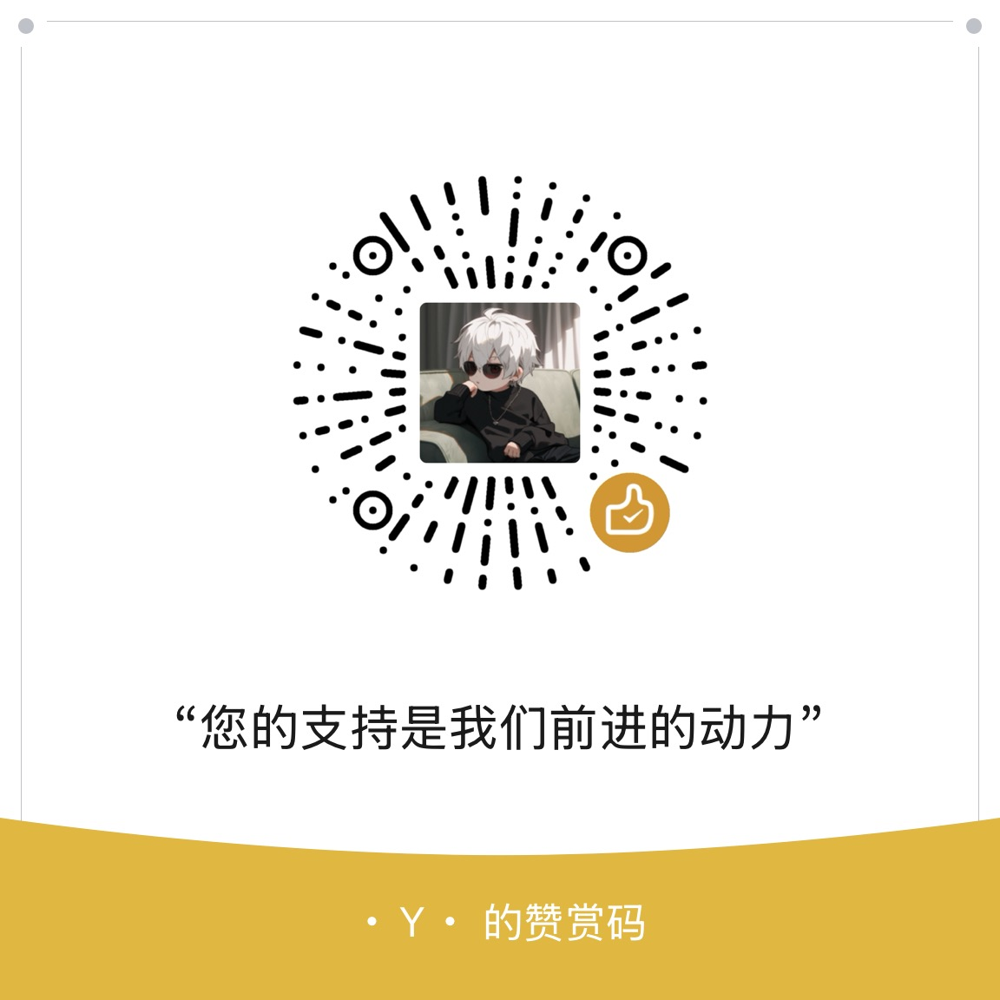

# 游戏认证助手（Android APK）

面向玩家的独立 APK 应用，用于便捷管理游戏账号与角色，并获取授权 Token（含缓存与一键登录）。本仓库仅提供可安装的 APK 与使用说明，不提供源码与实现细节。

## 功能亮点

- 登录方式：用户名/密码登录、短信验证码登录、微信扫码登录
- 账号与角色：绑定与管理、服务器列表查看、角色同步
- Token 管理：快速生成角色 Token，自动缓存（约 30 分钟）与刷新
- 一键登录：已绑定角色可直接发起一键登录流程
- 使用门禁：首次启动展示免责声明，需同意后继续使用

## 下载与安装

- 推荐：前往 GitHub Releases 页面下载最新版本 APK。

安装步骤：

1) 在系统设置中允许“未知来源安装”（不同厂商入口略有差异）
2) 将 APK 传至手机并点击安装
3) 首次启动按提示同意免责声明

## 快速上手

1) 添加账号：在首页点击“添加账号”，选择“账号登录 / 短信登录 / 微信扫码登录”完成绑定
2) 管理角色：登录后会显示已绑定的服务器与角色列表
3) 获取 Token：在角色卡片中点击“生成 Token”，应用会自动缓存并可复制使用
4) 一键登录：对支持的角色可直接点击“一键登录”快速进入

## 设备与权限

- 适配版本：Android 7.0 及以上（建议 Android 10+）
- 基本权限：网络访问、网络状态；部分机型可能提示存储权限用于导入/导出备份

## 隐私与数据

- 本应用用于账号授权与 Token 获取，不采集与上传无关的个人信息
- 登录凭据与 Token 仅用于与目标服务交互；请妥善保管、勿向他人泄露
- 使用公共或不受信任网络时请注意风险

## 常见问题（FAQ）

- 无法安装：请确认已允许“未知来源安装”，APK 完整且签名未被篡改
- 无法登录：检查网络连接与账号口令是否正确；短信登录请确保验证码在有效期内
- 无法扫码：若系统未安装或未授权微信，请先安装并授权相关权限
- 生成 Token 失败：稍后重试或切换网络；若持续失败，请在反馈渠道附带时间与账号场景

## 反馈与支持

- 建议在 GitHub Issues 反馈问题与建议（请勿附带隐私信息）
- 反馈内容建议包含：问题描述、机型与系统版本、APP 版本、时间点、复现步骤与截图

## 赞赏支持

如果本应用对你有帮助，欢迎赞赏支持开发与维护：

## 使用声明

- 本应用仅用于技术研究与个人学习，请遵守相关服务条款，不得用于商业或违规用途
- 与相关平台和游戏无关，所有商标与名称归其各自所有
- 使用本应用造成的任何后果由使用者自行承担
